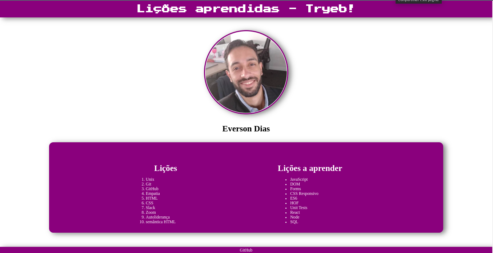

# Lessons Learned - Trybe School Project



## Projeto da Escola Trybe

Este projeto foi desenvolvido como parte da formação de Desenvolvedor Web na Trybe. O objetivo do projeto é ensinar o uso de HTML semântico e CSS para estilização.

## Tecnologias Utilizadas


## Acesso ao Projeto

Para acessar e executar este projeto, siga os passos abaixo:

1. Certifique-se de ter o Node.js e o npm instalados em sua máquina.

2. Clone o Projeto

```bash
git clone https://github.com/EversonDias/Project_Trybe_HTML_and_CSS_Lessons_Learned.git LessonsLearned
```

3. Entre na pasta

```bash
cd LessonsLearned
```

4. Rode o Projeto

```bash
npm start
```
